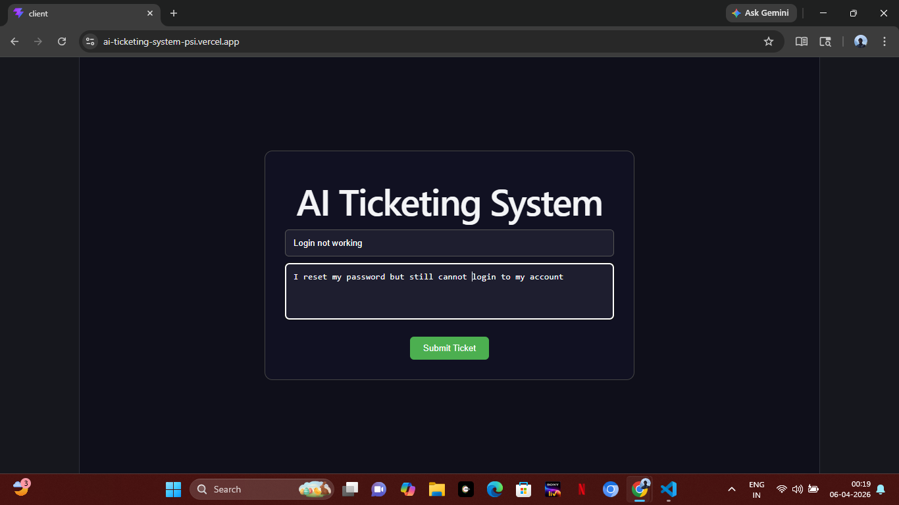
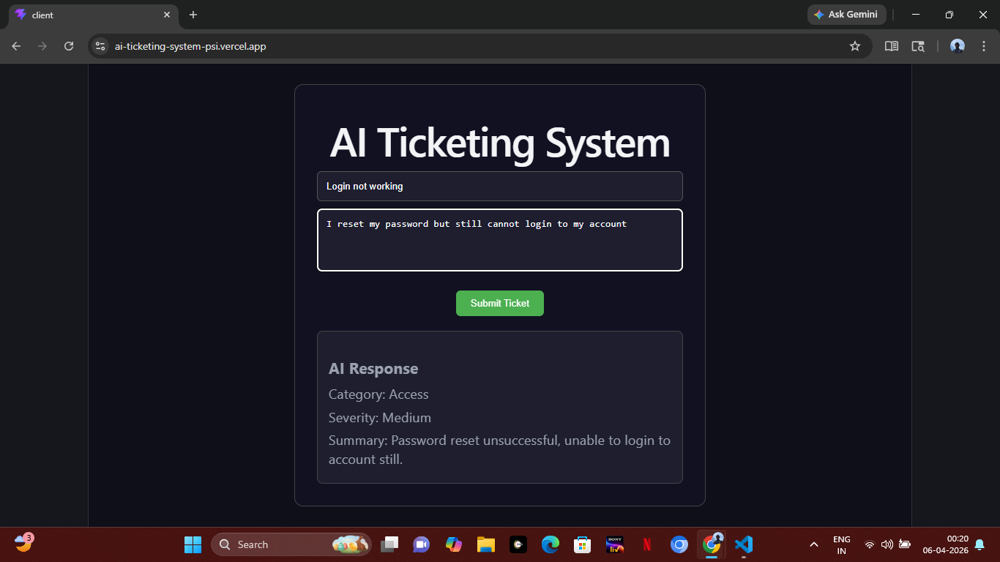

# AI Ticketing System

A full-stack AI-powered ticket classification system built using React, FastAPI, and LLaMA 3 (Groq).

---

## 🚀 Features

* Classifies support tickets into categories:

  * Access
  * Billing
  * Bug
  * Other
* Assigns severity levels:

  * Low
  * Medium
  * High
* Generates short AI-based summaries
* Real-time response with clean UI
* Fully deployed (Frontend + Backend)

---

## 🛠️ Tech Stack

* **Frontend:** React (Vite)
* **Backend:** FastAPI (Python)
* **AI Model:** Groq LLaMA 3.1 (llama-3.1-8b-instant)
* **Deployment:**

  * Frontend → Vercel
  * Backend → Render

---

## 🌐 Live Demo

Frontend: https://ai-ticketing-system-psi.vercel.app/

---

## ⚙️ How It Works

1. User enters ticket title and description
2. Backend processes input
3. Rule-based logic determines:

   * Category
   * Severity
4. AI model generates a short summary
5. Result is displayed instantly on UI

---

## 📌 Example

**Input:**

* Title: Login not working
* Description: I reset my password but still cannot login

**Output:**

* Category: Access
* Severity: Medium
* Summary: Password reset unsuccessful, unable to login

---

## 📸 Screenshots

### Input Form



### AI Response



---

## 🔒 Environment Variables

Create a `.env` file inside the `backend` folder:

```
GROQ_API_KEY=your_api_key_here
```

---

## ▶️ Run Locally

### Backend

```
cd backend
pip install -r requirements.txt
uvicorn main:app --reload
```

### Frontend

```
cd frontend/client
npm install
npm run dev
```

---

## ⚠️ Important Notes

* `.env` file is not included in GitHub for security
* CORS configured for frontend-backend communication
* API keys are securely handled using environment variables

---

## 🎯 Key Highlights

* Built full-stack AI application from scratch
* Integrated LLM for real-world use case
* Solved deployment challenges (CORS, API integration)
* Deployed production-ready system

---

## 🚀 Future Improvements

* Store tickets in database (SQLite / MongoDB)
* Add ticket history dashboard
* Add authentication system
* Improve UI/UX with better styling

---

## 👨‍💻 Author

Bachina Vishnu Vardhan

---
